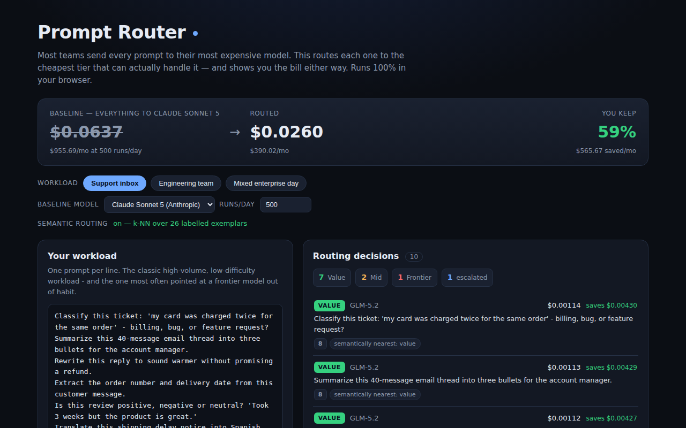

<div align="center">

# Prompt Router — Stop Sending Every Prompt to Your Most Expensive Model

**Paste a day's worth of prompts and watch each one get routed to the cheapest model tier that can actually handle it — an embedding + feature classifier running 100% in your browser, with a live savings ledger.**

[](https://github.com/kbipul/prompt-router/actions/workflows/ci.yml)
[](https://kbipul.github.io/prompt-router/)

`Day 8` of **[kb-daily-builds](https://github.com/kbipul/kb-daily-builds)** — one AI project a day.

</div>

## What it does

This week CNBC reported that somewhere between 30% and 46% of enterprise AI token spend at US companies is already flowing to cheap Chinese models. Z.ai's open-weights GLM-5.2 landed at $1.40/$4.40 per million tokens while matching frontier models on long-horizon coding. That moves the question. *"Which model is best?"* matters less now than *"which model is enough, for this specific prompt?"*

Prompt Router answers that question, per prompt, in your browser. Paste a workload, one prompt per line. Every line gets classified into a Value, Mid or Frontier tier, assigned the cheapest model in that tier, and priced. The header shows what the workload costs routed versus what it costs the way most teams actually run: everything to one frontier model. On the built-in sample workloads in `src/lib/workloads.ts` that gap runs 57–76%.

Two classifiers do the work, deliberately. A keyword and feature scorer is precise but blind. A k-NN vote over 26 hand-labelled exemplar prompts, using [all-MiniLM-L6-v2](https://huggingface.co/Xenova/all-MiniLM-L6-v2) embeddings, is fuzzy but understands meaning. `route()` blends the two, and then four guards get a look. A guard can only push a prompt *up* a tier. None of them can push one down.



<sub>The screenshot is captured by CI on a GitHub runner and committed back to this repo minutes after publish — the build sandbox has no browser, so it cannot fake one.</sub>

## Try it

The [live demo](https://kbipul.github.io/prompt-router/) runs fully in your browser. It needs no API key and no server, and it sends no telemetry. The 23MB embedding model downloads once from the Hugging Face CDN and is cached; until it lands, the router works on features alone.

```bash
git clone https://github.com/kbipul/prompt-router.git
cd prompt-router
npm ci
npm test      # 41 tests
npm run dev   # http://localhost:5173
```

## How it works

```
                    ┌──────────────────────┐
  prompt ──────────▶│ feature scorer       │──▶ 0-100  ─┐
         │          │ (regex, pure, 0ms)   │            │
         │          └──────────────────────┘            ├──▶ blend ──▶ tier
         │          ┌──────────────────────┐            │       │
         └─────────▶│ MiniLM embedding     │──▶ k-NN ───┘       │
                    │ + cosine vs exemplars│    vote            ▼
                    └──────────────────────┘              4 safety guards
                                                        (escalate only)
                                                                │
                                            Value / Mid / Frontier + cost
```

`extractFeatures` in `src/lib/features.ts` fires on code, math, multi-step structure, agentic loops, long context, non-Latin script and high-stakes vocabulary. It is fast and explainable. It also cannot tell *"add JSDoc comments"* (trivial) from *"refactor this module"* (not). The embedding router can, because it has no rules at all: 26 labelled exemplars and cosine similarity, k = 5. `route()` weights the two halves 50/50, which beat every lopsided split I tried against the sample workloads.

The two failure modes are not symmetric. Routing an easy prompt to an expensive model wastes a fraction of a cent. Routing a contract review to a bulk model can cost a company a lawsuit. So every guard moves a prompt *up*:

| Guard | Rule |
|---|---|
| 1 | High-stakes vocabulary (legal, medical, GDPR, compliance, production) never lands on the value tier |
| 2 | Agentic tool loops always go frontier, because errors compound across iterations |
| 3 | A split k-NN vote (< 55% agreement) buys insurance instead of guessing cheap |
| 4 | A *confident* semantic verdict (≥ 80%) overrules the blend upward |

It degrades rather than breaking. If the embedding model fails to load, because you are offline or behind a blocked CDN or in a locked-down corporate browser, the router keeps running on features alone and says so in the UI. In `route()` both `promptVec` and `exemplarVecs` are optional; when they are missing the semantic half of the blend is skipped and the decision carries the reason `feature-only mode (no embeddings)`.

## Build notes

One test caught a bug in my reasoning rather than in my code. I had asserted that an ambiguous prompt, one equidistant from cheap and expensive exemplars, would produce a low-confidence k-NN vote and trigger the escalation guard. It failed. Confidence came back at exactly 1.0. With one-hot fake embeddings and ten value exemplars sitting at identical similarity, the top-5 neighbours were *all* value. The vote was unanimous, and unanimously wrong. That is a real property of k-NN, not a test artifact: a confident-looking vote and a well-supported vote are not the same thing, and a router that reads the first as the second will cheerfully send your contract review to a bulk model at 100% confidence. I had to construct a genuinely split neighbourhood before the guard could be tested at all. It is the case named *escalates rather than guessing when the k-NN vote is split* in `src/lib/__tests__/route.test.ts`.

Two prompts broke my first set of weights in opposite directions. *"Prove this algorithm terminates, then derive its worst-case complexity"* scored 24 out of 100 and routed to the *cheap* tier. *"Debug why our webhook retries fire twice in production"* scored zero, because none of my regexes knew that "in production" is a high-stakes phrase. I fixed both by raising every "real work" signal above the value band on its own. The honest consequence: in feature-only mode the router now sends *every* code prompt to at least Mid, including "add JSDoc comments," which is obviously overkill. That is the correct behaviour for a blind router, and it is exactly what the 23MB of embeddings earns back. `difficultyScore` is pinned from the other side too, by the case *never lets length alone reach the frontier band*.

It would be trivial to write a router that saves 90% by being aggressive. It would also be worthless, because nobody deploys a cost optimiser they cannot trust with a liability clause. Every design decision here bends toward asymmetric caution: the blend can move a prompt down, but no guard ever can. The sample workloads therefore save 57–76% rather than the 85%+ I could have advertised, and the 8 percentage points I gave up are the reason a platform team would actually turn this on.

The bill lands on output tokens. Early versions priced on input length and the savings barely moved, because a 40-message email thread costs pennies to *read*. Output is billed at 3–6x input, so what actually matters is how much the model writes back, which is a function of the prompt's *shape* rather than its size. `expectedOutputTokens` estimates it per prompt type: 700 tokens for code or agentic work, 200 for structured extraction. Switching the ledger onto that estimate changed the numbers more than any routing improvement did.

## The exemplar set is the weak link

`src/lib/exemplars.ts` holds 26 prompts written by one person on one afternoon. It is the single weakest link in the system, and it is also the easiest thing to improve. Every verdict the semantic half produces is measured against those 26 lines, and the 57–76% figure comes from the built-in sample workloads rather than from anyone's production traffic.

The right version of this learns its labels from *your* traffic: log which prompts your team escalated by hand, and the exemplar set becomes an asset that compounds instead of a one-afternoon artifact. That is the version I would ship internally.

## Stack

| Layer | Choice |
|---|---|
| UI | React 18 + TypeScript 5 |
| ML | transformers.js (`Xenova/all-MiniLM-L6-v2`), running on WASM in-browser |
| Routing | Hand-written feature scorer + weighted k-NN over labelled exemplars |
| Build | Vite 6 |
| Tests | Vitest, 41 tests, all pure functions, zero network |

Prices are publicly cited list prices as of **2026-07-14**, editable in `src/lib/models.ts`. They move weekly, tokenizers differ, and your negotiated rate is not the list rate. Treat the *percentage*, not the dollar figure, as the finding.

---

<div align="center"><sub>
Built by <a href="https://www.kumarbipul.com"><b>Kumar Bipul</b></a> ·
IT Director → AI/ML · <a href="https://github.com/kbipul">github.com/kbipul</a>
</sub></div>
